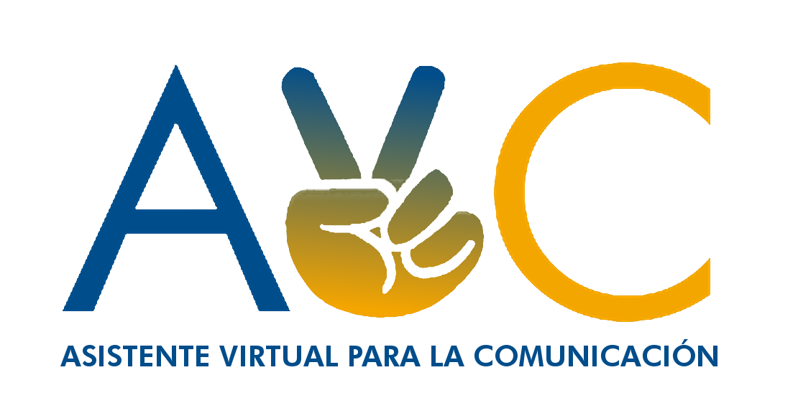

AVC
=

**Asistente Virtual para la Comunicación.**

**Realizado por**: José Miguel Ramírez Sanz.

**Tutores**: Dr. César Represa Pérez y Dr. José Francisco Diez Pastor.

---

### Resumen
La parálisis cerebral es una discapacidad que afecta a la capacidad
de movimiento y de la postura. Además, esta discapacidad suele ir
acompañada de otras discapacidades en la percepción de los sentidos y
en la capacidad cognitiva. Dentro de las personas afectas hay un grupo
gravemente afectado con grandes discapacidades motoras, cognitivas
y sobre todo comunicativas, ya que los únicos sonidos que emiten son
ruidos.

Con la idea de facilitar la comunicación de estos pacientes gra-
vemente afectados surgió la propuesta desde APACE Burgos para
desarrollar un comunicador virtual con el que poder interpretar los
sonidos que estas personas hacen. Es aquí cuando APACE Burgos
se puso en contacto con la Universidad de Burgos para desarrollar
AVC, el Asistente Virtual para la Comunicación.

Para la realización de este proyecto se han desarrollado varias
aplicaciones. Una para la recogida de los sonidos procedentes de los
pacientes con los que entrenar un clasificador, y otra aplicación para
la interpretación de los sonidos emitidos por los pacientes en base
a los datos registrados. También se ha desarrollado un servidor que
permite el almacenamiento de las opciones adicionales necesarias para
la clasificación, así como para poder interpretar los sonidos.
Las aplicaciones generadas durante este proyecto se han desarro-
llado en Android y se ha usado Python para desarrollar el servidor.

El asistente pretende reconocer emociones (hambre, tristeza, enfado y
dolor) y respuestas (sí y no) a partir de métodos de clasificación. Para
ello se han empleado algoritmos de extracción de características sobre
audios, y para el clasificador final se ha usado un tipo de ensemble
llamado Bagging, en concreto Random Forest.

### Abstract
Cerebral palsy is a disability that affects the ability to move
and posture. Besides, this disability is often accompanied by other
diabilities in the senses and the cognitive ability. There is a group of
people severely affected with large motor, cognitive and, above all,
communicative disabilities, because they can only communicate by
noises.

Thinking about facilating communication to severely affected
patients, APACE Burgos suggested to develop a virtual communicator
to interpret the sounds of these people. Here is when APACE Burgos
contacted with University of Burgos to develop VCA, the Virtual
Assitant for Communication.

For the realization of this project they have been developed some
applications. One for collectiong data from patients, and other one
to interpret the sounds emitted by patients. A server has also been
developed, to allow storage of the necesaary additional options for
the classification.

The generated applications during this project have been develo-
ped in Android and we have used Python for the development of the
server. To design the algorithms of classification of emotions (hungry,
sadness, anger and pain) and answers (yes and no) feature extraction
algorithms on sounds has been used, and for the final classifier we
have applied a type of ensemble called Bagging, specifically Random
Forest.
